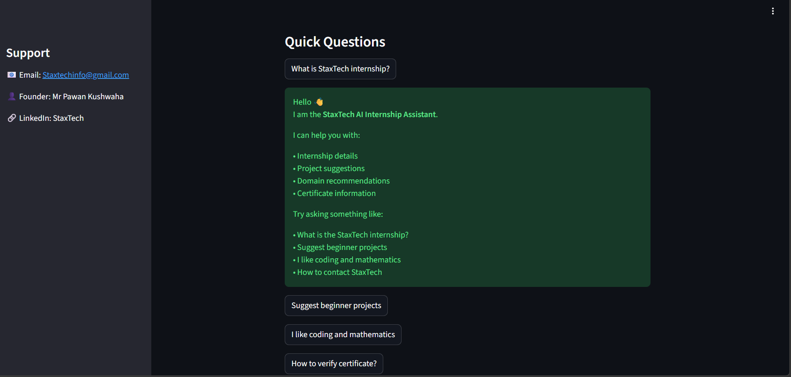
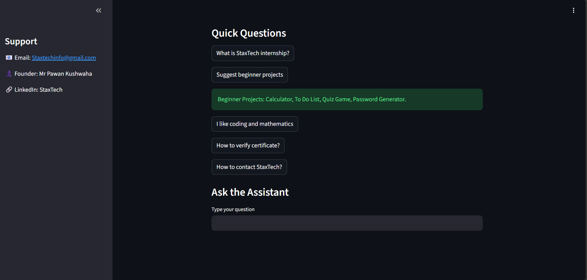
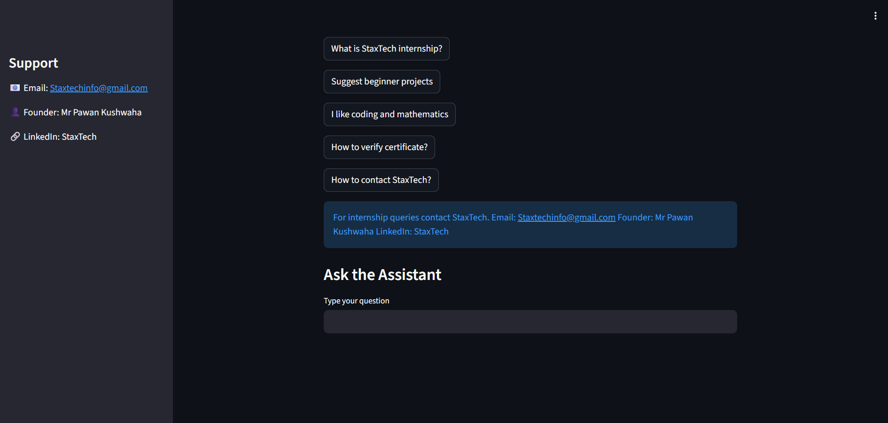
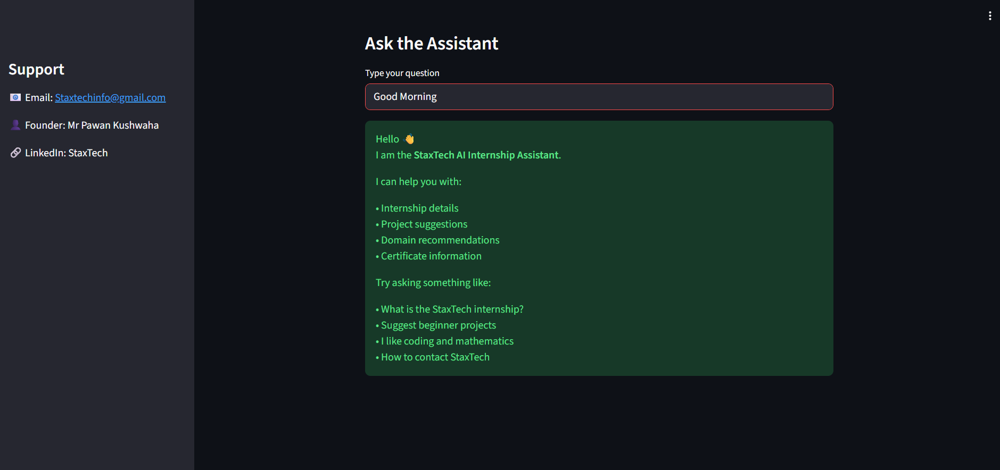

# StaxTech AI Internship Assistant 🤖

An **AI-powered chatbot** developed during the **StaxTech Artificial Intelligence Internship Program** using Python and Natural Language Processing concepts.

This chatbot helps users quickly understand the **StaxTech Internship**, available **projects**, and **recommended domains** based on their interests.

---

## 📌 Project Overview

The StaxTech AI Internship Assistant is designed to answer common internship-related questions automatically.

The chatbot reads a **structured JSON dataset** and provides relevant responses to users. It also suggests suitable domains and projects based on user interests.

This system helps students easily access information about:

* Internship details
* Recommended domains
* Beginner projects
* Certificate verification
* Contact information

---

## 🚀 Features

* Friendly greeting chatbot
* Internship information assistant
* Domain recommendation system
* Beginner project suggestions
* Contact information guidance
* JSON-based FAQ knowledge system

---

## 🛠 Technologies Used

* Python
* JSON
* Basic Natural Language Processing
* Rule-based chatbot logic

---

## 📂 Project Structure

```
staxtech_ai_project/
│
├── app.py                # Main chatbot application
├── requirements.txt      # Required Python libraries
│
├── dataset/
│   └── faq_data.json     # Chatbot knowledge base
│
├── outputs/              # Chatbot demo screenshots
│
└── README.md
```

---

## 💬 Example Questions

Users can ask questions like:

* Hello
* What is the StaxTech internship?
* Suggest a beginner project
* Which domain is good for AI?
* How can I verify my certificate?
* How can I contact StaxTech?

---

## 👩‍💻 Author

**Tasneem Fathima**
Artificial Intelligence Intern – StaxTech

---

## 📸 Demo Screenshots

### Chatbot Interface



### Greeting Response



### Domain Recommendation



### Project Suggestions


